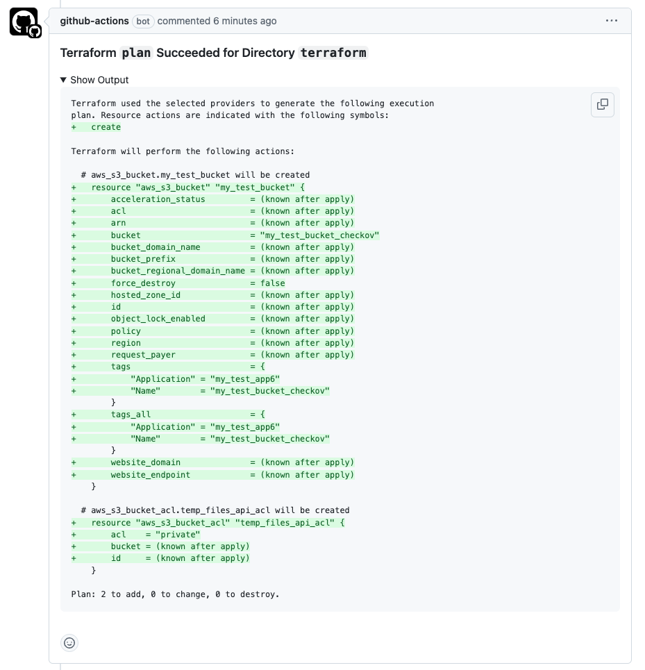

# Terraform Orchestrator: Automate Your Infrastructure with GitHub Actions 🚀

Supercharge your Terraform workflows with automated CI/CD and PR insights!

## Overview

Managing infrastructure with Terraform can be complex, especially in collaborative environments.  
**Terraform Orchestrator** simplifies this by **automating** Terraform execution and integrating with **GitHub PR workflows**, ensuring every infrastructure change is validated and tracked.

With **Terraform Orchestrator**, you can:

- Prevent misconfigurations with automated Terraform checks.
- Get instant feedback with `terraform plan` results directly in PRs.
- Keep PR discussions clean with auto-updated comments.

Designed for **DevOps teams**, this action **boosts collaboration** and **improves infrastructure visibility** in CI/CD pipelines.

## 🚀 Features

- 🔄 **Automated Terraform Execution**: Run `fmt`, `init`, `validate`, `plan`, and `apply` automatically.
- 🔍 **Smart Change Detection**: Runs Terraform **only on modified directories**.
- 📢 **PR Integration**: Posts `terraform plan` results as comments in pull requests.
- 🪟 **Auto-clean PR Comments**: Keeps discussions clean by replacing outdated plans.
- ⚡ **Fast & Lightweight**: Optimized for speed and efficiency in GitHub Actions.

## Repository Structure

```
├── action.yaml              # Defines the GitHub Action
├── assets/
│   └── pr_commenter.png      # Image used in documentation
├── cmd/
│   ├── pre-requirements.sh   # Ensures dependencies like tfenv & jq are installed
│   ├── terraform.sh          # Core script executing Terraform commands & PR comments
├── LICENSE
└── README.md
```

## How It Works

1. **Pre-requisite Check**:

   - The `pre-requirements.sh` script verifies that `tfenv` (Terraform version manager) and `jq` (JSON processor) are installed. If missing, it installs them.

2. **Terraform Execution**:

   - The `terraform.sh` script automatically identifies modified Terraform directories and runs the appropriate Terraform commands.

3. **GitHub Pull Request Integration**:
   - If a **PR is opened**, the action runs `terraform plan` and posts the results as a **comment on the PR**.
   - If a previous plan comment exists, it is **deleted and replaced** with the latest results.

## Workflow Permissions

This GitHub Action requires the following permissions:

- **Pull Requests**: Write access to post comments on PRs.

To enable these permissions, add the following to your workflow file:

```yaml
permissions:
  pull-requests: write
```

## Usage

To use this GitHub Action in your repository, create a workflow file like this:

```yaml
name: "Terraform CI/CD"

on:
  pull_request:
    branches:
      - main
  push:
    branches:
      - main

permissions:
  pull-requests: write

jobs:
  terraform:
    runs-on: ubuntu-latest
    steps:
      - name: Checkout Repository
        uses: actions/checkout@v3

      - name: Terraform Init
        env:
          GITHUB_TOKEN: ${{ secrets.GITHUB_TOKEN }}
        uses: andresb39/tf-orchestrator@v1-beta
        with:
          arg: init

      - name: Terraform Plan
        env:
          GITHUB_TOKEN: ${{ secrets.GITHUB_TOKEN }}
        uses: andresb39/tf-orchestrator@v1-beta
        with:
          arg: plan
```

## Environment Variables

| Variable                 | Description                                                             |
| ------------------------ | ----------------------------------------------------------------------- |
| `GITHUB_TOKEN`           | Required for posting comments on PRs                                    |
| `GITHUB_EVENT_PATH`      | Path to GitHub event payload                                            |
| `EXPAND_SUMMARY_DETAILS` | (Optional) Expand PR summary details (default: true)                    |
| `HIGHLIGHT_CHANGES`      | (Optional) Highlight changes in `terraform plan` output (default: true) |

## 📢 Example PR Comment

Terraform Orchestrator automatically posts `terraform plan` results as comments on pull requests, providing clear visibility into infrastructure changes before they are applied.



This feature helps teams **collaborate efficiently** by showing the exact infrastructure modifications in a structured and readable format.

## 🚀 Get Started Now!

🔗 **Start using Terraform Orchestrator today!**  
📚 Read the [full documentation](#) | ⭐ Star this repo on [GitHub](https://github.com/andresb39/tf-orchestrator)

## 👨‍💻 Authors

This action was developed by **@andresb39, @AnthonyMYCD, and @YesMCD** at **myCloudDoor** (January 2025). 🚀
